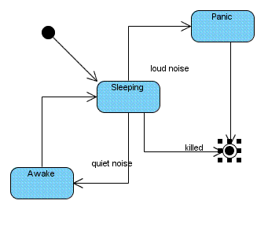
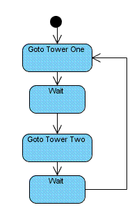

# Continuting GameMonkey Script: Advanced Use

## Foreword

This article is the revised version of that [originally published in 2009 on GameDev.net](https://www.gamedev.net/tutorials/_/technical/game-programming/continuing-gamemonkey-script-advanced-use-r2666/). There are several aspects that are out of date, however the article has been left in its original form for preservation and posterity.

## Introduction

By reading my *Introduction to GameMonkey Script* articles you have been
introduced to the basic features of the *GameMonkey Script* (GM Script
or simply 'GM' herein) language and how to embed it into your game or
application. This article will teach you some of the more advanced
aspects of the GM language and the virtual machine API. I will begin by
describing the functionality and provide examples in GameMonkey Script
code itself as this allows simple and quick demonstration of the
features. I will then continue this discussion with examples in C++ code
to demonstrate how to access this functionality from within your game
engine itself.

In order to follow this article you are assumed to have read, understood
and implemented the ideas and examples presented in the introductory
articles. It is also expected that you are familiar with concepts such
as simple messaging systems and event handlers so that you can follow
some of the sample code without issue.

This article covers the following topics:

- Cooperative Threads
- Blocking / Signalling
- Threads and 'this'
- Thread States
- The Structure of a Thread
- Creating Script-Extensible Entities
- Best practices for using GameMonkey

## Scripting Cooperative Threads

Every script running within the GM virtual machine is executed within
its own "thread". A "thread" is standalone in that it has its own
executable bytecode and stack but it runs within the overall context of
the GameMonkey machine so can access data and functions from other
threads. Unlike your operating system's definition of a "thread", the GM
virtual machine is based around a co-operative threading model, so that
upon every execution of the gmMachine::Execute() method each thread must
either complete (terminate) or *yield* to the machine to allow other
threads a chance to execute.

When a thread runs, it executes a *function*, a sequence of bytecode
that is contained within its own *stackframe*. Whenever you execute a
script in GameMonkey the bytecode is compiled into a function and is
actually created within a thread to be executed. As a result, any
explicit creation of your own threads will need a function to actually
execute. This concept will be covered in more detail in a later section
of this article.

### Creating Threads from Script

There are two ways of creating a thread in GM; the first is via the
scripting language itself -- there is an in-built function called
thread() that takes the thread function and the values to be passed to
this function as arguments. The following example demonstrates how to
create a new thread from script:

```
  global thread_1 = function( a_count ) {
    print( "[1] Starting..." );
    for (i = 0; i < a_count; i = i + 1)
    {
      print( "[1] iteration: " + i );
    };

    print( "[1] Finishing..." );
  };

  print( "[0] Ready to execute..." );
  thread( thread_1, 100 );
  sleep(1);
  print( "[0] Thread created..." );
```

**Example: threads_01.gm**

```
  [0] Ready to execute...
  [1] Starting...
  [1] Iteration 0
  ...
  [1] Iteration 99
  [1] Finishing...
  [0] Thread Created...
```

**Output: threads_01.gm**

In this example, a new thread is created within the machine which
executes a function to count from 0 to 99. It will continue until the
function is completed, hogging the machine's runtime until it is done.
In this example, the sleep() function is called to yield control from
the main thread and into the new thread we create. Use of sleep will be
discussed later on in this article.

### Yielding Thread Execution

Now that you are able to spawn a new scripted thread you can begin to
run processes co-operatively. As mentioned before, GM is **not** based
upon a pre-emptive threading environment so each thread needs to *yield*
to others after it has finished a portion of work; it is up to the
script writer to define what a portion of 'work' for a thread and should
be.

In the following example we create two threads, each counting from 0 to
a specified number. This example does not use yield() -- what do you
think will happen when you run it?

```
  global thread_func = function( a_name, a_count ) {
    print( "["+a_name+"] Starting..." );
    for (i = 0; i < a_count; i = i + 1)
    {
      print( "["+a_name+"] iteration: " + i );
    };

    print( "["+a_name+"] Finishing..." );
  };

  print( "[0] Ready to execute..." );
  thread( thread_func, 1, 100 );
  thread( thread_func, 2, 100 );
  sleep(1);
  print( "[0] Thread created..." );
```

**Example: threads_02.gm**

```
  [0] Ready to execute...
  [1] Starting...
  [1] Iteration 0
  ...
  [1] Iteration 99
  [1] Finishing...
  [2] Starting...
  [2] Iteration 0
  ...
  [2] Iteration 99
  [2] Finishing...
  [0] Thread Created...
```

**Output: threads_02.gm**

As you see from the output of the script, the two threads ran
consecutively and not concurrently as you might have expected. The
reason for this is that although two threads were created, the first was
executed which blocked the second thread until it had completed. Once
complete, the second thread was free to run until completion. If you
intended to run a single cycle of each thread in turn you need to tell
the GM machine when to yield execution to other threads. In order to
tell a thread to yield, you simply call the scripted function yield()
with no parameters.

The following example is the same script but with a yield() in the loop
of each function.

```
  global thread_func = function( a_name, a_count ) {
    print( "["+a_name+"] Starting..." );

    for (i = 0; i < a_count; i = i + 1)
    {
      print( "["+a_name+"] iteration: " + i );
      yield();
    };

    print( "["+a_name+"] Finishing..." );
  };

  print( "[0] Ready to execute..." );
  thread( thread_func, 1, 100 );
  thread( thread_func, 2, 100 );
  sleep(1);
  print( "[0] Thread created..." );
```

**Example: threads_03.gm**

```
  [0] Ready to execute...
  [1] Starting...
  [1] Iteration 0
  [2] Starting...
  [2] Iteration 0
  ...
  [1] Iteration 99
  [2] Iteration 99
  [1] Finishing...
  [2] Finishing...
  [0] Thread Created...
```

**Output: threads_03.gm**

After running the above script, you will see that instead of running
consecutively as witnessed in the first example the two threads appeared
to run concurrently. Internally, the GM machine ran only one thread at a
time but the yield() command instructed the virtual machine to switch
contexts and execute the next thread.

Sometimes you may want to pause a thread for a specific length of time,
for example if you had an NPC that needed to wait for 10 seconds at a
waypoint before moving on. This can be achieved using the script command
sleep(), which takes a numeric parameter of how many seconds the thread
needs to sleep for. A sleeping thread yields until the sleep duration
has passed, after which it resumes execution of the next command. Try
experimenting with the samples above and replace a yield() with sleep to
see the effects it has on execution.

### Blocking and Signalling

In the real world context of a game you will not be using long loops and
yield() very often; instead thread execution and context switching can
be controlled by the more powerful blocking and signalling mechanism
provided by GameMonkey. In games you would use a scripted thread to act
as the 'brain' of an entity which would 'think' on every game cycle and
perform an action based on an event or stimulus; the majority of the
time it may be sitting waiting for that trigger, potentially by checking
a loop. The following example demonstrates the traditional and extremely
inefficient way of doing this:

```
  global WakeUp = false;

  global thread_1 = function( a_count ) {

    while (WakeUp == false)
    {
      // Snooze
      print("zzz");
      yield();
    }
    print("I just woke up, boy was I tired!");
  };

  // Launch thread
  thread( thread_1 );

  // Sleep for 1 secs then set the wakeup variable
  sleep(1);
  WakeUp = true;
```

**Example: blocking_01.gm**

When running the script, you will see a screen full of *"zzz"'s* before
the thread 'wakes up'. The thread is actually still running here, taking
up CPU cycles and waiting for the *WakeUp* call. GM presents a much more
efficient way of handling this scenario via its *blocking* and
*signalling* mechanism.

A thread can block itself until a specific signal (or one of several
signals) is received. Blocking effectively takes a thread out of the
active thread pool, yielding until a signal wakes it up. A simple
example is demonstrated below:

```
  global thread_1 = function() {
    block("WAKEUP");
    print("I just woke up, boy was I tired!");
  };

  // Launch thread
  thread( thread_1 );

  // Sleep for 1 secs then set the wakeup variable
  sleep(1);
  signal("WAKEUP");
```

**Example: blocking_02.gm**

The thread will block until it receives a signal string of *"WAKEUP"*,
which is sent to it after 1 second. This is more efficient as it's not
taking up interpreted script cycles checking for a scripted variable,
we're literally waiting upon a message from the GameMonkey machine to
continue. It is important to remember that a thread can block or signal
on any gmVariable and not specifically strings, which I have used here
as the most intuitive way to demonstrate the functionality.

Let's take a look a more complicated example involving two threads. Each
thread will be created consecutively and will block on a different
signal. The first signal will be thrown after the *sleep* command, which
in turn will signal the other thread.

```
  global thread_1 = function() {
    block("WAKEUP");
    print("I just woke up, boy was I tired! You should wake up too!");
    signal("YOUTOO");
  };

  global thread_2 = function() {
    block("YOUTOO");
    print("What did you wake me up for?");
  };

  // Launch thread
  thread( thread_2 );
  thread( thread_1 );

  // Sleep for 1 secs then set the wakeup variable
  sleep(1);
  signal("WAKEUP");
```

**Example: blocking_03.gm**

```
  I just woke up, boy as I tired! You should wake up too!
  What did you wake me up for?
```

**Output: blocking_03.gm**

Often it is desirable for a thread to be able to block until it receives
one of a selection signals - for example, you may want your scripted
entity to walk to an area and then wait there until it receives a
command to move to another point, attack an entity or indeed simply
defend itself. The block and signal mechanism offers support for this by
allowing you to block on multiple signals. The signal which resumes the
thread is returned from the block command allowing you to act in
appropriate manner.

```
  global blockfunc = function() {
    print( "Waiting for instruction, sir!" );
    signal_received = block("attack", "move", "defend");
    if(signal_received == "attack")
    {
      print("Attacking!");
    }
    else if (signal_received == "move")
    {
      print("Moving to position!");
    }
    else if (signal_received == "defend")
    {
      print("Defending til the death!");
    }
  };

  thread( blockfunc );
  sleep(1);
  signal("attack");
```

**Example: blocking_04.gm**

```
  Waiting for instruction, sir!
  Attacking!
```

**Output: blocking_04.gm**

In the example above, the thread will block upon 3 signals, *attack,
move* or *defend*. The signal received will determine what the thread
then proceeds to do -- in this case the attack signal is received so the
entity attacks.

Each of the signalling examples presented until now have relied upon the
signal being global, meaning that if two threads were waiting on the
same signal, they would both be activated together. In games this would
mean that all of your game units waiting for a wakeup call will spring
into action at once. You will be relieved to know that it is possible to
send a signal to a single thread rather than globally. To achieve this
you must know the *Thread Id* of the thread you're signalling, this is
returned by the normal thread function when you first create the thread.
The following example is adapted to demonstrate the same block function
being used with multiple threads.

```
  global blockfunc = function(name) {
    print( name + ", waiting for instruction, sir!" );
    signal_received = block("attack", "move", "defend");

    if (signal_received == "attack")
    {
      print(name + " is attacking!");
    }
    else if (signal_received == "move")
    {
      print(name + " is moving to position!");
    }
    else if (signal_received == "defend")
    {
      print(name + " is defending til the death!");
    }
  };

  thread_1 = thread( blockfunc, "woob" );
  thread_2 = thread( blockfunc, "foo" );

  sleep(1);

  signal("attack", thread_1);
  signal("defend", thread_2);
```

**Example: blocking_05.gm**

```
  woob, waiting for instruction, sir!
  foo, waiting for instruction, sir!
  woob is attacking!
  foo is defending til the death!
```

**Output: blocking_05.gm**

As you have seen, the blocking and signalling mechanism in GameMonkey
Script allows you to create multiple threads within the virtual machine
and have them remain dormant and taking up no execution cycles until a
signal is received to call it back into action. This allows you to
design complex behaviours within your entities that respond to the
signals that are sent back and forth between objects.

### Script Threads and 'this'

Now that you've explored the topics of GameMonkey's threading model,
using block to pause them and signal to resume execution, it's time to
look at how we can use the concept of this with threads to open up a lot
of power for scripting in your game.

Each thread has a special gmVariable associated with it - the this
variable. The concept of this allows you to effectively run a thread
against an object and always have that object in scope. If you recall in
the introductory article, I demonstrated how you could use this to
reference specific objects in function calls. In GameMonkey's threading
system, this can be used in exactly the same way, except that it can be
accessed in every function. See the example that follows:

```
  global my_entity = {
    x = 50, y = 100, name = "test"
  };

  global move_ent_left = function() {
    print( "Starting thread - this.name = " + .name );

    while( this.x > 0 )
    {
      this.x = this.x - 10;
      print( this.name + " - x = " + this.x );
      yield();
    }

    print( "Ending thread - this.name = " + .name );
  };

  my_entity:thread( move_ent_left );
  sleep(1);
```

**Example: threads_this_01.gm**

```
  Starting thread -- this.name = test
  test -- x = 40
  test -- x = 30
  ...
  Ending thread -- this.name = test
```

**Output: threads_this_01.gm**

The code demonstrated above creates a simple table called *my_entity*,
which has members *x*, *y* and *name*. The function *move_ent_left* will
simply decrement the x position of this by 10 units, is created in the
global scope and accepts no parameters, so we can't 'cheat' by passing
an object instance to the function.

The thread itself is created as normal using the thread() function, but
with one key difference -- the my_entity table is passed as this via the
syntax my_entity:thread( func );

The next example will show the move_ent_left function being used for
multiple objects and on multiple threads.

```
  global robot = {
    x = 50, y = 100, name = "robot"
  };

  global player = {
    x = 150, y = 200, name = "player"
  };

  global move_ent_left = function() {
    print( "Starting thread - this.name = " + .name );

    while( this.x > 0 )
    {
      this.x = this.x - 10;
      print( this.name + " - x = " + this.x );
      yield();
    }

    print( "Ending thread - this.name = " + .name );
  };

  robot:thread( move_ent_left );
  player:thread( move_ent_left );
  sleep(1);
```

**Example: threads_this_02.gm**

```
  Starting thread -- this.name = robot
  robot -- x = 40
  Starting thread -- this.name = player
  player -- x = 140
  ...
  Ending thread -- this.name = robot
  player -- x = 90
  player -- x = 80
  ...
  Ending thread -- this.name = player
```

**Output: threads_this_02.gm**

Clever use of threads and this is an extremely useful way of giving
different entities different behaviours, even if they have the same
properties; all you would need to do is pass different functions on the
thread. In the example that follows, we define 5 "robots" that each
posses a different behaviour -- this behaviour is executed at runtime.

```
  global create_robot = function(x, y, name) {
    return { x = x, y = y, name = name, id, class="robot" };
  };

  global behaviour_stupid = function() {
    print( .name + " is acting stupidly" );
  };

  global behaviour_seek = function() {
    print( .name + " is seeking resources" );
  };

  global behaviour_rest = function() {
    print( .name + " is resting" );
  };

  global robot_def = {
    {"tom", behaviour_seek},
    {"mike", behaviour_rest},
    {"jane", behaviour_stupid},
    {"bob", behaviour_stupid},
    {"sarah", behaviour_seek}
  };

  for(id = 0; id < 5; id = id + 1)
  {
    robot = create_robot(1 * id, 10 * id, robot_def[id][0]);
    robot:thread(robot_def[id][1]);
  }

  sleep(1);
```

**Example: threads_this_03.gm**

```
  tom is seeking resources
  mike is resting
  jane is acting stupidly
  bob is acting stupidly
  sarah is seeking resources
```

**Output: threads_this_03.gm**

If the *robot* were your normal game entity that is displayed on screen,
I'm sure you could appreciate how being able to script them in this way
is extremely powerful.

### Thread States

Games often utilise finite state machines to control the behaviour and
state of an object. State machines are often used in game entity
artificial intelligence scripts which may want to act upon a specific
stimulus and then return to their previous state. Consider the PacMan
ghosts who change into to a 'panic' state when the PacMan eats a
power-up and then revert back to 'roaming' once the power-up has worn
off; or the patrolling unit in an RTS game that encounters an enemy,
intercepts to attack it and then resumes its patrol once the threat has
passed.

I have demonstrated how you can effectively use different functions to
interact with a scripted object through the use of threads and this. As
you have seen, GameMonkey Script threads execute a function - the state
binding allows you to change the function that is running on a thread.
The thread will keep the same Thread Id, but will lose any locally
defined variables in the change of execution context. The following code
will demonstrate how to initiate a state and change to another:

```
  global awake = function() {
    print("I'm awake!");
  };

  global resting = function() {
    print("I am resting");
    sig = block("wakeup");
    if (sig == "wakeup")
    {
      stateSet( awake );
    }
  };

  global init_state = function() {
    // Set a state on the thread
    // we're now using states
    stateSet( resting );
  };

  thread( init_state );
  sleep(1);
  signal("wakeup");
```

**Example: states_01.gm**

```
I am resting
I'm awake!
```

**Output: states_01.gm**

The state of a thread is set by the first call to the in-built global
function stateSet() that accepts the new state function and any
additionally required parameters. You will notice that this behaves
almost exactly how you created the thread in the first place, except
this time you are still using the current thread and just changing the
function that is being executed. If you want to pass this to the new
state, you must explicitly do so when calling stateSet().Once you have
set a thread state you can transition to a new state at any time by a
subsequent call to stateSet().

Any subsequent changes in state allow you to query the current state
function by calling stateGet() or the previous state by calling
stateGetLast(). This is useful as GameMonkey allows you to do
comparisons on functions, letting you react according to the previous
state or simply just resume the previous behaviour by switching the
state back to what it was before. If stateGet() returns null, the thread
isn't engaged in state behaviour; likewise if stateGetLast() returns
null the thread hasn't had a previous state.

The example that follows will demonstrate an object that is created,
blocks until a condition is met, performs an action and then resumes the
previous action. In one object, it will start as *asleep*, stir and then
go back to *sleep* -- another will start *asleep*, get panicked at a
loud noise and then cause all sorts of chaos for the player.

```
  global ent_state_panic = function() {
    print(.name + " is panicking, firing off alarms and attracting attention to you");
  };

  global ent_state_awake = function() {
    print(.name + " is waking up");
    this:stateSet( stateGetLast() ); // revert to previous state
  };

  global ent_state_sleeping = function() {
    print(.name + " is sleeping");
    sig = block("quiet_noise", "loud_bang", "kill");

    if (sig == "quiet_noise")
    {
      this:stateSet( ent_state_awake );
    }
    else if (sig == "loud_bang")
    {
      this:stateSet( ent_state_panic );
    }
    else
    {
      print( .name + " killed" );
    }
  };

  /// Initialise the state on the entity
  global ent_state_init = function(func) {
    print( .name, " state initialised");
    this:stateSet(func);
  };

  global ent_1 = { name = "roboguard 1000" };
  global ent_2 = { name = "old ticker" };

  // Create two threads, one for each entity and initialise them in the sleeping state
  ent_1.threadid = ent_1:thread( ent_state_init, ent_state_sleeping );
  ent_2.threadid = ent_2:thread( ent_state_init, ent_state_sleeping );

  sleep(1);
  print("You stand on a twig");
  signal("quiet_noise");
  sleep(1);

  print("You fire a gun at " + ent_1.name + " causing a loud noise");
  signal("loud_bang", ent_1.threadid);

  // Tell the entity to die
  signal("kill", ent_2.threadid);
```

**Example: states_02.gm**

```
  roboguard 1000 state initialised
  roboguard 1000 is sleeping
  old ticker state initialised
  old ticker is sleeping
  You stand on a twig
  old ticker is waking up
  old ticker is sleeping
  roboguard 1000 is waking up
  roboguard 1000 is sleeping
  You fire a gun at roboguard 1000 causing a loud noise
  roboguard 1000 is panicking, firing off alarms and attracting attention to you
  old ticker killed
```

**Output: states_02.gm**

The state transitions involved above are described in this diagram:



**Image: blocksigstates.gif**

Sometimes it's useful to know about a state change before it happens to
allow you to run cleanup code or trigger another behaviour. To achieve
this you can call the function stateSetExitFunction() and pass a
function object. The function you pass will be called just before the
state of the thread changes, allowing you to run whatever code you need
to. When the function completes the state will transition as expected;
you could use this to play a sound effect before the real event happens,
for example.

```
  global awake = function() {
    print("I'm awake!");
  };

  global waking = function() {
    print("I am stirring...");
  };

  global resting = function() {
    print("I am resting");

    sig = block("wakeup");
    if (sig == "wakeup")
    {
      stateSetExitFunction( waking );
      stateSet( awake );
    }
  };

  global init_func = function() {
    // set state on thread
    stateSet( resting );
  };

  thread( init_func );
  sleep(1);
  signal("wakeup");
```

**Example: states_03.gm**

```
  I am resting
  I am stirring...
  I'm awake!
```

**Output: states_03.gm**

All state changes happen on the currently operating thread, but
sometimes it would be useful to change the state of another thread in
the machine. Imagine you have a thread blocking on a signal for the
player to move out of cover; if the cover explodes, you may want to
force the players taking cover into a different state, such as the one
that decides the next action. The stateSetOnThread() function allows you
to do just this and requires a thread id and a state function.

```
  global state_advance = function() {
    print("Leaving cover and advancing");
  };

  global state_decide_action = function() {
    print("I have to decide on a next action");
  };

  global state_hiding = function() {
    print("Behind cover, waiting to advance");
    sig = block("advance");
    if (sig == "advance")
    {
      stateSet( awake );
    }
  };

  global init_state = function() {
    stateSet( state_hiding );
  };

  tid = thread( init_state );
  sleep(1);

  // Signal isn't thrown, tell this thread to change state
  print("Cover explodes!");

  stateSetOnThread( tid, state_decide_action );
```

**Example: states_04.gm**

```
  Behind cover, waiting to advance
  Cover explodes!
  I have to decide on a next action
```

**Example: states_04.gm**

As you have seen, the threading functionality built into GameMonkey
Script provides a useful toolset to control behaviours of your entities
and offers flexible solutions to achieve your scripting needs.

## Integrating GameMonkey with your Game

GameMonkey Script offers a lot of advanced
functionality to script your game entities which can become quite
complex for your script writers. In a real-world usage scenario you may
wish to simplify your scripting interface and use many of GameMonkey
Script's threading features invisibly. For example, if you create an NPC
entity that has an update routine it is often more intuitive for a
script writer to simply write a script such as:

```
  npcupdatefunc = function() { ... do stuff... };
  npc = createNPC(npcupdatefunction);
```

Rather than:

```
  npcupdatefunc = function() { ... do stuff... };
  npc = createNPC();
  npc:thread(npcupdatefunction);
```

Your game may also feature asynchronous events such as dialog boxes or
entity movement instructions that use the blocking functionality.

This section will describe how to work with the GameMonkey Script API to
take advantage of the threading functionality and offer some simple
methods by which you can simplify the interface you provide to your
script writers without compromising on the flexibility offered by the
scripting language.

### Creation of gmThreads

A new thread can be created at *any* time in the virtual machine by
calling the gmMachine::CreateThread() method. The result of this action
is that a new gmThread object is created and a unique thread id is
returned. You can call this method passing a gmVariable to act as this
and importantly, a gmVariable containing the gmFunctionObject that the
thread needs to execute. The following code demonstrates the creation of
a simple thread via the API that calls an existing function within
script -- for simplicity's sake this script is embedded in the
application.

```
  #include <iostream>
  #include "gmThread.h"

  int main(int argc, char* argv[])
  {

    // Create gm virtual machine
    gmMachine gm;

    // A test script which creates the function we're testing
    const char *testscript = "global threadfunc = function() { print(\"Hello, threads!\"); };";

    // Execute the script to create the function in the VM
    if (gm.ExecuteString( testscript, NULL, true ))
    {
      bool first = true;
      std::cout << gm.GetLog().GetEntry(first);
      return 1;
    }

    int new_threadId = 0;

    // Allocate a thread within the machine
    gm.CreateThread( gmVariable::s_null, gm.GetGlobals()->Get(&gm, "threadfunc"), &new_threadId );

    // Execute the machine
    gm.Execute(1);
    return 0;
  }
```

**Example: threads_01a.cpp**

The code is simple; a script is executed to create the scripted function
(a global named *threadfunc*) and a new thread is created using the
reference to the script function obtained by reading from the global
table. One thing to note is that as we've created a *scripted* function
using script, we need to call gmMachine::Execute() to run the thread
because the original ExecuteString() call actually created a thread to
run in and it is still seen as the active thread in the machine.

To demonstrate the passing of this to a thread upon creation we simply
pass an actual variable installed of gmVariable::s_null (the static null
value variable). An example of this follows, you will notice that the
string I pass as this is available in the script function we call.

```
  #include <iostream>
  #include "gmThread.h"

  int main(int argc, char* argv[])
  {
    // Create gm virtual machine
    gmMachine gm;

    // A test script which creates the function we're testing
    const char *testscript = "global threadfunc = function() { print(\"'this' passed as - \", this); };";

    // Execute the script to create the function in the VM
    if (gm.ExecuteString( testscript, NULL, true ))
    {
      bool first = true;
      std::cout << gm.GetLog().GetEntry(first);
      return 1;
    }

    int new_threadId = 0;

    // Allocate a thread within the machine
    gm.CreateThread( gmVariable(gm.AllocStringObject("Hello, this!")), gm.GetGlobals()->Get(&gm, "threadfunc"), &new_threadId );

    // Execute the machine
    gm.Execute(1);

    return 0;
  }
```

**Example: threads_01b.cpp**

As you expect, it's entirely possible to execute a native function as
the thread function, you simply bind the function as normal and use the
gmFunctionObject pointer wrapped up by a gmVariable. The following code
demonstrates the same result as the first, this time binding a function
and calling that.

```
  int GM_CDECL gmMyThreadFunc(gmThread *a_thread)
  {
    std::cout << "Hello, threads!" << std::endl;
    return GM_OK;
  }

  int main(int argc, char* argv[])
  {
    // Create gm virtual machine
    gmMachine gm;

    // Bind the function to use by creating a gmFunctionObject
    gmFunctionObject *threadfunc = gm.AllocFunctionObject( gmMyThreadFunc );

    int new_threadId = 0;

    // Allocate a thread within the machine
    gm.CreateThread( gmVariable::s_null, gmVariable(threadfunc), &new_threadId );

    return 0;
  }
```

**Example: threads_02.cpp**

Any object can be passed to the thread as this if it has been registered
within the gmMachine as a gmType and wrapped in a gmVariable. The
following example shows how you can access this in the callback via the
gmThread::GetThis() method. In this case I expect it to be a string
type, but in your code you'd most likely use your own entity types.

```
  int GM_CDECL gmMyThreadFunc(gmThread *a_thread)
  {
    GM_ASSERT( a_thread->GetThis()->m_type == GM_STRING );

    gmStringObject *thisstr = reinterpret_cast<gmStringObject*>(a_thread->GetThis()->m_value.m_ref);

    std::cout << "'this' passed as " << thisstr->GetString() <<
    std::endl;
    return GM_OK;
  }

  int main(int argc, char* argv[])
  {
    // Create gm virtual machine
    gmMachine gm;

    // Bind the function to use by creating a gmFunctionObject
    gmFunctionObject *threadfunc = gm.AllocFunctionObject( gmMyThreadFunc );

    // Add function to the global table so scripts can access it
    gm.GetGlobals()->Set(&gm, "threadfunc", gmVariable(threadfunc) );

    // Call script to make callback, pass a variable containing "hello" as this
    const char *script = "text = \"hello\"; text:thread( threadfunc );";

    gm.ExecuteString( script );
    return 0;
  }
```

**Example: threads_03.cpp**

### Working with 'this'

So far, most of the C++ binding examples we've been using have relied on
us passing the objects to work on as a parameter to the callback
functions. However you're more likely to want to pass this to functions
explicitly or implicitly by binding them to an instance of a type --
this is how we've been doing it in many of the actual scripts you've
seen. This next section will demonstrate how to access and use this in
your native callbacks and continue to provide a simple example of some
code to extend your bound types.

As you have seen previously, every gmThread has a stack slot allocated
for the this variable. This can be accessed in raw gmVariable form by
calling gmThread::GetThis(). The main difference between GetThis() and
Param() is that GetThis() returns the gmVariable via a const pointer and
not by value like the Param() functions. In the previous example
(threads_03.cpp), you were accessing a string variable passed as this.
It is often required that you validate the type of this variable -- the
gmThread.h file defines a series of useful macros for checking function
parameters, there are also a few for checking the type of this, such as
GM_CHECK_THIS_STRING, which will return a thread exception if this is
passed as anything other than a string type.

Like the Param() functions, there are several helpers for automatically
and safely converting this back to the various native types associated
with the GameMonkey type. So, for example ThisString() returns as a
const char* and ThisInt() returns an int.

```
  int GM_CDECL gmThisTest(gmThread *a_thread)
  {

    GM_CHECK_THIS_STRING;

    std::cout << "'this' passed as " << a_thread->ThisString() <<
    std::endl;
    return GM_OK;
  }
```

**Example: this_01.cpp**

There are three methods for returning your user types, ThisUser()
returns a void* and the gmType of the object it holds;
ThisUserCheckType() will only return a non-NULL pointer to the object if
the type you pass in matches the object type and finally
ThisUser_NoChecks() passes you just the pointer to the data held in the
user object. Of course, these are simply common conversions -- you are
encouraged to create your own routines should you require anything else,
such as converting back and forth to your entity type automatically.

### Script-Extensible Objects

The use of this becomes incredibly important when it comes to working
with your own user types and binding functions and data to them. The
rest of this section will demonstrate a highly simplified game entity
class that allows you to extend it with scripted properties.

The first thing we do is define our game entity. In this example we
declare it to have the following attributes:


**Variable** | **Read/Write?** | **Description**
---|---|---
Id | Read        | Guid of the entity
X  | Read, Write | X position of the entity
Y  | Read, Write | Y position of the entity

If you think back to the simple Vector binding I demonstrated in the
original articles, you will remember that we used the raw Vector*
pointer as the data tied to GameMonkey and bound the Dot/Ind operators
to allow modification of the underlying data. This time along we want to
take advantage of the flexibility of GameMonkey and effectively allow
additional properties to be added to the object -- for example, allowing
the script writer to add a "name" property to the object.

```
  struct Entity
  {
    Entity() : Id(0), X(0), Y(0) { }
    Entity(int id) : Id(id), X(0), Y(0) { }
    int Id, X, Y;
  };
```

**Example: ext_01.cpp**

The first step to achieving this goal is to create a proxy object that
holds both the raw Entity data and a gmTableObject that will be used to
hold our additional properties; this proxy is represented by a
ScriptEntity class. We have a choice to make at this stage; do we want
to be invasive to the Entity class and allow it to hold a pointer to the
ScriptEntity or do we want the ScriptEntity to wrap the Entity object? I
have chosen to add a pointer to the ScriptEntity into the Entity class;
this enables any other consumers of the Entity class to be aware of the
additional properties and create their own or read any existing ones --
this allows for some nice data-driven entities to be created as you will
see shortly.

```
  struct ScriptEntity
  {
    ScriptEntity(Entity &ent) : EntityObject(ent), ScriptProperties(NULL) {}
    Entity &EntityObject;
    gmTableObject *ScriptProperties;
  };
```

**Example: ext_01.cpp**

Once the basic objects have been defined the type is bound as normal. I
have bound a global function createEntity() to the script environment
which will allocate a new Entity from the EntityManager and also
allocate a new ScriptObject and gmTableObject for it.

```
  int GM_CDECL gmCreateEntity(gmThread *a_thread)
  {
    // Create an entity from the manager
    int entityId = 0;

    Entity &ent = s_EntityManager.CreateEntity(entityId);

    // Allocate a script entity & construct it
    ScriptEntity *sent = reinterpret_cast<ScriptEntity*>(s_scriptents.Alloc());

    GM_PLACEMENT_NEW( ScriptEntity(ent), sent );

    // Tie back to entity
    ent.ScriptObject = sent;

    // Create a property table
    sent->ScriptProperties = a_thread->GetMachine()->AllocTableObject();

    // Tell GM how much memory we're using
    int memadjust = sizeof(gmTableObject) + sizeof(Entity) + sizeof(ScriptEntity);
    a_thread->GetMachine()->AdjustKnownMemoryUsed(memadjust);

    // return to client
    a_thread->PushNewUser( sent, s_entitytype );
    return GM_OK;
  }
```

**Example: ext_01.cpp**

I've chosen to use some of the in-built GameMonkey memory allocation
routines for the ScriptEntity creation (gmMemFixed); this is a fairly
simple fixed memory allocator which uses a freelist for reallocations.
You are free to use the normal new and delete operators or to rely on
memory allocation routines from your own engine.

Once this function is bound, you can create entities in script -- but
they're not much use until you bind the operators. In this case I will
bind the GetDot and SetDot operators only. They will both work in
similar ways; the object is retrieved from the relevant operand and the
text of the property is resolved from the gmStringObject it is passed
as. If the property is resolved to either *X, Y* or *Id* (the properties
of the Entity class), we simply access the relevant property on the
Entity. Any other property accesses will go straight to the
gmTableObject we created on the ScriptEntity, thus allowing us to get
and set properties that didn't exist on the base class. The SetDot
operator code is shown below as an example.

```
  void GM_CDECL gmOpSetDot(gmThread *a_thread, gmVariable *a_operands)
  {
    if (a_operands[0].m_type != s_entitytype)
    {
      a_thread->GetMachine()->GetLog().LogEntry( "gmEntity:OpSetDot invalid type passed" );
      a_operands[0] = gmVariable::s_null;
      return;
    }

    // Get scriptentity back
    ScriptEntity *sent = reinterpret_cast<ScriptEntity*>(a_operands[0].GetUserSafe(s_entitytype));

    // Get name of 'get' prop
    std::string propname = a_operands[2].GetCStringSafe();

    // Test for our known properties and return their values back immediately

    if (propname == "X")
    {
      sent->EntityObject.X = a_operands[1].GetIntSafe();
    }
    else if (propname == "Y")
    {
      sent->EntityObject.Y = a_operands[1].GetIntSafe();
    }
    else if (propname == "Id")
    {
      a_thread->GetMachine()->GetLog().LogEntry( "gmEntity:OpSetDot cannot set Id" );
      a_operands[0] = gmVariable::s_null;
    }
    else
    {
      // Otherwise, store a value in the table
      sent->ScriptProperties->Set(a_thread->GetMachine(), propname.c_str(), a_operands[1]);
    }
  }
```

**Example: ext_01.cpp**

When you bear in mind that GameMonkey Script functions can also be
stored as variables, you will see that you can start adding scripted
functions to the base entity class with ease -- be it from the C++ API
or from script itself. All functions invoked on the object have this
implicitly passed, so code such as the following is possible:

```
  ent = createEntity();
  ent.name = "somebody";
  ent.sayname = function() {
    print( "My name is: ", this.name );
  };

  ent.sayname();
```

By using the C++ API and accessing this, you can begin to add some
script-bound functions to the ScriptEntity's ScriptProperties table with
ease. The following example shows a simple function that displays the
entity's position, id and name -- with name being a property added
within script.

```
  // The entity is passed as this
  int GM_CDECL gmEntityInfo(gmThread *a_thread)
  {
    ScriptEntity *sent = reinterpret_cast<ScriptEntity*>(a_thread->ThisUserCheckType(s_entitytype));

    if (sent == NULL)
    {
      a_thread->GetMachine()->GetLog().LogEntry("gmEntityInfo: Expected entity type as this");
      return GM_EXCEPTION;
    }

    std::stringstream infotext;
    infotext << "EntityId: ";
    infotext << sent->EntityObject.Id;
    infotext << " - Postition("; infotext << sent->EntityObject.X;
    infotext << ","; infotext << sent->EntityObject.Y; infotext << ") - Name: ";

    // Get name from table and pass to object
    gmVariable namevar = sent->ScriptProperties->Get(a_thread->GetMachine(), "name");

    if (namevar.IsNull() || namevar.m_type != GM_STRING)
    {
      infotext << " [No name]";
    }
    else
    {
      infotext << namevar.GetStringObjectSafe()->GetString();
    }

    std::cout << infotext.str() << std::endl;
    return GM_OK;
  }
```

**Example: ext_01.cpp**

In the full example code ext_01.cpp (not shown), I added an entry to the
ScriptProperties table to automatically hold this function for each
entity created by the script engine:

```
  // Bind an additional method to the entity's prop table
  sent->ScriptProperties->Set(a_thread->GetMachine(), "ShowInfo", gmVariable( a_thread->GetMachine()->AllocFunctionObject(gmEntityInfo)) );
```

The script we run can be modified as follows to use the new function:

```
  ent = createEntity();
  ent.name = "somebody";
  ent.ShowInfo();
```

And the output?

```
  EntityId: 1 -- Position(100,0) -- Name: somebody
```

In this section you've learned how to use GameMonkey Script to extend an
existing native class and attach new data and functions to it. Armed
with this information you are free to create powerful entity types and
allow your script writers to extend them without any changes to the
engine code.

### Threads, The Stack and Function Calls

As threads are an important part of GameMonkey Script, I will use this
section to cover how they work in more detail. I will also discuss how a
function is called within the GameMonkey Virtual Machine (VM) and how
this is tied to threads.

A thread on the VMis composed of the following components:

- A unique identifier
- A stack
- A function to execute
- A pointer to the current instruction (if any)
- A list of blocks and signals pending on the thread
- State information about the thread

The thread stack is a effectively a list of gmVariable objects that is
used to hold the function being executed, the variable for this, any
function parameters passed to the thread and then finally any working
variables, including return values from functions.

The thread function is a gmFunctionObject which can be either a native
function callback or a scripted function. A scripted function is a
series of bytecode instructions that are interpreted by the GameMonkey
VM to create the behaviours you see in script. The execution of the VM
bytecode is dependent on the structures in the thread and the VM cannot
execute a function without it.

When a function is called in GameMonkey, what actually happens? The
first thing pushed to the stack is a variable containing this, it will
contain null if there is no value for this. A variable holding the
function object is next to be pushed to the stack, followed by any
function parameters in order. Finally, a stackframe is pushed to
complete the setup and initialise all internal data and structures to
ready the thread for execution on the VM. The stackframe is important as
it allows the VM to maintain the correct pointers to instructions and
data to, for example, allow nested function calls to be made within the
system. The function is then executed by the virtual machine, either by
calling a native function or by interpreting the bytecode involved with
the scripted function. Any return value is pushed back to the stack and
the stack frame is popped, allowing the script to continue where it left
off before the function call.

We can see this in action by manually creating a thread and calling a
native function. The first code we write is a simple function that
accepts two integer parameters and writes them to cout.

```
  int GM_CDECL gmFunctionTest(gmThread *a_thread)
  {
    GM_CHECK_INT_PARAM( a_param1, 0 );
    GM_CHECK_INT_PARAM( a_param2, 1 );
    std::cout << "Param 1: " << a_param1 << std::endl;
    std::cout << "Param 2: " << a_param2 << std::endl;
    return GM_OK;
    }
```

Next, we follow the steps detailed above to call the function via the
GameMonkey API.

```
  gmMachine gm;
  int threadid = 0;

  gmThread *thread = gm.CreateThread(&threadid);
  thread->PushNull(); // Push 'this'
  thread->PushFunction( gm.AllocFunctionObject(gmFunctionTest) ); // push function to call
  thread->PushInt(50);
  thread->PushInt(100);
  thread->PushStackFrame(2);
```

**Example: functioncall_01.cpp**

As you can see, we create a thread, push the required information to it
and then finally execute it by pushing the stack frame using
gmThread::PushStackFrame. If the function were a scripted function, you
would need to run it by executing the thread using gmThread::Sys_Execute
or by using gmMachine::Execute() to execute the whole machine.

```
  gmMachine gm;

  // Create a global scripted function
  gm.ExecuteString(
    "global func = function(a, b) { print(\"Param 1:\", a); print(\"Param 2:\", b); };"
  );

  gmFunctionObject *func = gm.GetGlobals()->Get(&gm, "func").GetFunctionObjectSafe();

  int threadid = 0;

  gmThread *thread = gm.CreateThread(&threadid);
  thread->PushNull(); // Push 'this'
  thread->PushFunction( func ); // push function to call
  thread->PushInt(50);
  thread->PushInt(100);
  thread->PushStackFrame(2);
  thread->Sys_Execute();
```

**Example: functioncall_02.cpp**

If we'd have wanted to return a value from the function it's a simple
case of pushing it to the stack before we return and retrieving it
either by getting the top of the stack from the thread, or if it was a
scripted function the call to Sys_Execute accepts an optional pointer to
a gmVariable allowing you to capture this if you need to.

This section has shown you how to manually call functions and how they
interact with the threads and stack. It is recommended that you use the
gmCall helper for most of your script calls as it wraps all of this
functionality for you already and reduces the chance of errors
occurring.

### Callback Return Values

So far, all of the examples of bound functions you've seen have returned
GM_OK or GM_EXCEPTION. This section will describe how these are used by
the virtual machine and discuss other values you can use.

When a function call is made or an operator callback is invoked, you
have a chance to indicate success or failure to the VM execution engine.
If the call is successful (GM_OK), everything continues as normal -- but
what happens if there is an error? An error could be that you received
the wrong parameter type to a function callback, or maybe even an
internal game error that requires your script environment to be
notified. In such cases, you would return a value of GM_EXCEPTION to the
thread, which has the effect of causing it to terminate.

Usable values are as follows:

**Value**    | **Meaning**
---|---| 
GM_OK        | Success
GM_EXCEPTION | An error occurred
GM_SYS_YIELD | Causes a thread to immediately yield execution to another thread
GM_SYS_BLOCK | A block has been set on the thread, see later for more detail
GM_SYS_SLEEP | Force the thread to sleep after setting the Sys_SetTimeStamp and Sys_SetStartTime values accordingly.

There are other values available but they are internal and shouldn't be
used for risk of corrupting the execution of the VM.

### Signalling via the API

Like using signals in the script language you can signal threads from
the API. This allows you to implement event-based systems that trigger
game events as signals to the entire virtual machine as or to specific
threads that are running on particular game entities. One use may be an
RPG game that pops up a dialog box for a quest; in script you'd tell the
engine to open the quest dialog with a specific text and wait for the
user to accept or decline it. An example script would look like:

```
  ShowQuestDialog( Quests.SaveThePrincess );

  response = block( QuestDialog.Accept, QuestDialog.Decline );
  if (response == QuestDialog.Accept)
  {
    // do something
  }
  else
  {
    // do something else
  }
```

In this example, the ShowQuestDialog() function would be a native
function that pops up a non-modal dialog that itself waits for a button
response event from your GUI subsystem. As the dialog is non-modal, you
need your script to respond from the user's input in some way, so you
block on two signals to indicate accept or decline. Because the thread
is waiting for a block it becomes dormant in the GameMonkey machine and
therefore takes up no execution time until it's woken by a signal. The
signal itself would be fired by your script subsystem in response to a
GUI button press event for that specific dialog.

Let's look at some sample code:

```
  enum QuestDialog
  {
    QD_DECLINE,
    QD_ACCEPT
  };

  // This function simulates a modal quest dialog
  int GM_CDECL gmShowQuestDialog(gmThread *a_thread)
  {
    std::cout << "A princess is in danger, do you wish to save her?" << std::endl << "[Accept | Decline]" << std::endl;
    return GM_OK;
  }

  void HandleUserAcceptQuest(gmMachine &gm, int threadid, QuestDialog response)
  {
    // Fire signal to thread to indicate user's choice
    gm.Signal( gmVariable( (int)response ), threadid, 0 );
  }

  int main(int argc, char* argv[])
  {
    gmMachine gm;

    // Bind ShowQuestDialog function to script
    gm.GetGlobals()->Set( &gm, "ShowQuestDialog", gmVariable(gm.AllocFunctionObject( gmShowQuestDialog )) );

    // Create a global table to hold Ids for QuestAccept/Decline
    gmTableObject *dialogResponses = gm.AllocTableObject();
    dialogResponses->Set( &gm, "Accept", gmVariable(QD_ACCEPT) ); // Accept = 0
    dialogResponses->Set( &gm, "Decline", gmVariable(QD_DECLINE) ); // Decline = 0
    gm.GetGlobals()->Set( &gm, "QuestDialog", gmVariable( dialogResponses ) );

    // Run an example script that calls dialog and blocks on response
    const char *script = "ShowQuestDialog(); \n"
      "response = block( QuestDialog.Accept, QuestDialog.Decline ); \n"
      "if (response == QuestDialog.Accept) { print(\"[Quest accepted]\"); } else { print(\"[Quest declined]\"); }";

    int threadid = 0;

    // Run script and capture thread it's running on
    gm.ExecuteString( script, &threadid );
    Sleep(5000); // Wait for 5 seconds to simulate user deciding to accept
    HandleUserAcceptQuest(gm, threadid, QD_ACCEPT);

    // Tick the machine along
    gm.Execute(0);

    return 0;
  }
```

**Example: signals_01.cpp**

The majority of the code is actually setting up our global script
variables and binding the demonstration quest dialog function. The
sample script is run on the machine which immediately calls the quest
dialog function (in your implementation you'd open a real GUI window)
and then immediately blocks for the response. The signal itself is sent
via a call to gmMachine::Signal, which accepts a gmVariable and an
optional thread Id -- you will see that this is identical to calling
signal from script.

A second example is that of a door created in script. The door itself
will remain closed until the game instructs it to open, perhaps by a
person using a switch or firing some kind of trigger. The script for the
door is simple; the door is created and immediately blocks for the
signal to open. When this trigger is received, an animation game event
is played asynchronously while the door script sleeps for 5 seconds.
After it resumes, the close animation is played and the door goes back
to blocking -- this behaviour will repeat forever or until the thread is
terminated by the game, perhaps in response to the door becoming
impassible or destroyed.

```
  global DoorFunction = function() {
    while(true)
    {
      print(this, "waiting for use...");
      block("usedoor");
      this:startAnimation("dooropen");
      sleep(5);
      this:startAnimation("doorclose");
    }
  };

  createDoor(DoorFunction);
```

**Example: signals_02.cpp -- Door Script**

The native callback createDoor() will create a new door instance and run
the function you pass it. Note that in this example I just demonstrate
the object using a text string, your game will most likely feature an
actual door entity being created and returned as a user object.

```
  int GM_CDECL gmCreateDoor(gmThread *a_thread)  {

    GM_CHECK_FUNCTION_PARAM(a_func, 0);

    // Simple example, return "TESTDOOR" as the user object
    gmStringObject *door = a_thread->GetMachine()->AllocStringObject("TESTDOOR");

    // Call passed in function as a new thread (gmCall does this under the hood)
    gmCall gmcall;
      gmcall.BeginFunction(a_thread->GetMachine(), a_func, gmVariable(door), false);
    gmcall.End();

    a_thread->PushString(door);
    return GM_OK;
  }
```

**Example: signals_02.cpp**

To open the door at any point in the game, you fire the signal. I'm
executing the next frame of the VM manually here, but your game loop
will be doing this each frame automatically.

```
  // Open the door... fire global signal for now
  gm.Signal(gmVariable( gm.AllocStringObject("usedoor") ), GM_INVALID_THREAD, 0);
```

**Example: signals_02.cpp**

The output of this whole example:

```
  TESTDOOR waiting for use...
  TESTDOOR starting animation: dooropen
  TESTDOOR starting animation: doorclose
  TESTDOOR waiting for use...
```

**Output: signals_02.cpp**

This example is an excellent way of showing how the thread that controls
the door can be created within the game code itself, removing the need
for a user to explicitly create them to run the door script. To the
user, they are simply creating a door that will play out their
behaviour, they don't even have to know about the signal being fired by
the game.

### Blocking via the API

It is possible to set a thread to block using the API and it allows more
flexibility than blocking in script. When you block from within the GM
Scripting language itself the currently executing thread is suspended
immediately and is set to the status of "blocked". Blocking a thread
from the API allows you to continue processing as normal; the blocked
state of the thread is only registered upon the next execution cycle of
the virtual machine. To block a thread, you need to use the
gmMachine::Sys_Block function; this function takes a thread Id and a
list of gmVariables to block on. Although it is possible to block on a
thread that isn't the current thread, it is not recommended as it may
cause undesirable or unpredictable behaviour in the scripts running on
the machine (such as a thread blocking for a signal that will never
occur).

A quick example will show you how to set up a block via script:

```
  enum
  {
    SIG_ZERO,
    SIG_ONE
  };

  int GM_CDECL gmBlockTest(gmThread *a_thread)
  {
    gmVariable blocks[] = { gmVariable(SIG_ZERO), gmVariable(SIG_ONE) };

    int ret = a_thread->GetMachine()->Sys_Block( a_thread, 2, blocks );
    if (ret == -1)
    {
      return GM_SYS_BLOCK;
    }
    a_thread->Push(blocks[ret]);
    return GM_OK;
  }
```

**Example: blocks_01.cpp**

In this callback function I have set up two variables containing the
values 0 and 1 and have instructed the GameMonkey machine to block the
currently running thread on them. Under the hood, the
gmMachine::Sys_Block function will attempt to use up any signals already
pending on the thread; if a matching signal is found for one of the
blocks, it will return immediately with the index of the block variable
you supplied. When this happens, I push the variable back to the thread
stack as a return value so that it returns the block immediately to the
user to allow them to check which block was signalled. If no
corresponding signal is found, Sys_Block returns a value of -1 -- when
this happens you return a value of GM_SYS_BLOCK to indicate to the VM
that this thread should be suspended until a signal is received to wake
it. When you bind the function above to the machine, it lets you run a
script such as:

```
  r = blocktest();

  print( "signal fired:", r);
```

This will block until you signal the thread either using
gmMachine::Signal or the signal() command from script.

Games often feature asynchronous actions, such as playing an animation
or sound, actor pathfinding/movement and so on. In the real world, many
of these actions will be kicked off with an event dropped onto a message
queue which is picked by the relevant system. Imagine the case of an NPC
being instructed to move across town; the entity management system will
pick up the movement message and move the entity a little bit each frame
until the NPC arrives at its destination many frames later. At this
point the entity manager it will signal back to the game that the
movement has completed.

Your scripts will often want to trigger asynchronous behaviours but will
need to treat them as if they are synchronous by waiting for the result
of the task before deciding how to proceed. If the machine-bound
function returned immediately after queuing the message, the script
would continue as normal without waiting for completion. In a previous
section you achieved this in script by using GameMonkey's blocking and
signalling functionality; in this case you could fire your event and
then immediately block for the signal back from the game engine to wake
up the thread.

```
  doasyncbehaviour();
  ret = block( "ok", "failed" );
  // continue as normal
```

Although this works, it can be a little clunky in practice and requires
that your script writers always remember to block after an asynchronous
behaviour. In this next section I will demonstrate an example of working
with asynchronous game events elegantly with GameMonkey Script.

For this example I will allow you to imagine a town guard in an RPG game
that wanders back and forth between two towers. When he gets to a tower,
he'll inspect the area and move on if nothing is amiss. The guard's
behaviour is described as the following series of states:



**Image: guardstates.gif**

In the game engine this will be achieved by initiating the movement
using a *goto* message to the entity manager. Upon arrival at the
destination a *goto_success* message is sent back to the game system --
should anything happen such as the destination being unreachable, the
entity being attacked or so on, a *goto_failed* message is sent back to
the game, along with other messages for the next action (if any).

The sequence of events in this asynchronous call are as follows:

1. Script calls NPCWalkTo( dest )
2. Game pushes goto message to message queue
3. Script call blocks thread and returns
4. Game frame advances, entity manager picks up movement message
5. Entity manager moves NPC each frame until destination is reached
6. Message is sent back to script manager to inform destination reached
7. Script manager signals thread of completion, script progresses as
8. normal

Look at the example code blocking_02.cpp for a simple yet realistic
implementation of the above behaviour. In the code, we bind two
functions to the GameMonkey machine, CreateNPC() which is tied into the
game's entity manager and NPCGoto() which accepts an entity and a
location as a parameter. In this simple example, the location is either
TOWER_ONE or TOWER_TWO in the global Location table. In a real game
you'd most likely specify a vector, or would bookmark real locations
with names like TOWER_ONE. The first thing we do in the script is create
the guard NPC and start a thread for it to run in.

```
  global GuardMove = function() {
    this:stateSet(GuardGotoTowerOne);
  };

  npc = CreateNPC();
  npc:thread(GuardMove);
```

The guard's behaviour function immediately jumps into the state that
tells it to go to the first tower.

```
  global GuardGotoTowerOne = function() {

    print("Going to Tower One...");

    res = NPCGoto(this, Location.TOWER_ONE);

    if (res == Event.SUCCESS)
    {
      print("Arrived at tower One");
      this:stateSet(GuardWait);
    }
    else
    {
      print("Couldn't get there");
    }
  };
```

This script function calls the NPCGoto() function and passes TOWER_ONE
as a location for this entity to travel to. The native code behind this
function fires off a message to the game system that indicates we want
to move the entity to the specified location.

```
  GM_CHECK_INT_PARAM(a_entity, 0);
  GM_CHECK_INT_PARAM(a_location, 1);

  // Push message to Game Message queue
  NPCGotoMessage *msg = new NPCGotoMessage( a_entity, a_thread->GetId(), a_location );

  s_Game.GetMessageSystem().PushMessage( msg );
```

The bound function then immediately sets up a block on the scripted
thread that suspends it until we've received the success or failure
result back from the game.

```
  gmVariable blocks[] = { gmVariable(SM_SUCCESS), gmVariable(SM_FAILED) };

  int res = a_thread->GetMachine()->Sys_Block( a_thread, 2, blocks );

  if (res == -1)
  {
    return GM_SYS_BLOCK;
  }
```

The game continues as normal, the entity manager picks up the
NPCGotoMessage we posted and processes the movement of the entity each
frame. In this example we're using a time based trigger that fires after
a few seconds, but in a real game you would move an entity's
co-ordinates in the world.

```
  if (_Dur >= 2500.0f) // Simulate time passing
  {

    NPCArrivalMessage *msg = new NPCArrivalMessage(ent._Id, ent._ScriptThreadId, ent._Destination);

    s_Game.GetMessageSystem().PushMessage(msg);
    ent._State = Entity::ES_WAITING; // Go back to waiting state

    _Dur = 0;
  }
```

The script manager system is set up to listen for an NPCArrivalMessage;
when it recieves one it will post the result of the movement request
back on the entity's thread in the form of a signal.

```
if (a_msg->MessageType == MT_GOTO_SUCCESS)
{
  NPCArrivalMessage *msg = reinterpret_cast<NPCArrivalMessage*>(a_msg);

  // Fire signal on thread
  _Machine.Signal( gmVariable(SM_SUCCESS), msg->ScriptThreadId, 0 );
}
```

The GameMonkey Script machine processes the signal on the next update
and the thread resumes operation, in this case the script is written to
change state to the waiting state and then progress from there to
TOWER_TWO.

As you can appreciate, this set up allows you to write scripts for
entities as if they are synchronous and not worry about the complex
message handling systems your engine may implement. By treating the
NPCGoto function as a normal function call and hiding the blocking
behaviour, you enable your script writers to write simple logic and not
worry about anything that may happen internally in your game.

## Best Practices

Now that you've explored GameMonkey Script in detail you will be aware
that is a highly flexible language; like many other programming
languages there are a series of best-practices to follow for both
scripting and embedding the language in your games.

### Avoid inline script

Although some of the examples here have scripts embedded within the C++
code, this should be avoided in a production environment. The single
biggest benefit of a scripted language is that it helps avoid recompiles
of your game engine should game logic need changing -- by inlining your
script you will lose out on this benefit. It is advised that you load
your scripts at runtime using your own load routines; you should also
bind a function similar to Lua's dofile function that allows you to load
and execute scripts from files at runtime. A non-portable example is
available via the gmSystemLib binding that ships with GM.

### Minimise Globals

Like many other programming languages, the use of global variables and
functions should be kept to a minimum. Although convenient, a game will
feature tens, hundreds, if not thousands of scripted functions to create
its behaviours. When you rely entirely on globals you are forced to use
warts to prefix each function name to allow you to differentiate between
behaviours for different entity types. If specific behaviours and
functions are to be shared across multiple entity types, it is worth
considering, but for many cases it is not necessary. The best solution
is to bind specific functions to your entity type libraries and to
investigate some of the extensibility methods I discussed earlier to
allow you to attach functions to a hidden table on the entity. This way,
all the functions will implicitly be called with this as your entity
type and you can code in a very object-oriented manner.

You may then choose to 'wrap' the base entity creation routines in
specialised versions that attach functions and properties automatically.
For example:

```
  global createGuardNPC() = function(name) {

    ent = createEntity();
    ent.name = name;
    ent.type = "GuardNPC";
    ent.stateWander = function () { ... };
    return ent;
  }
```

Your users can then create specialised entities that come pre-made with
behaviours and you have a central place for the definition.

### Separate Logic across Files

Like many scripting languages, GameMonkey doesn't have a default IDE --
therefore you are responsible for organising and tracking the files
involved in your project. Your game will likely feature the behaviours
of multiple entity types in GameMonkey script so for ease of navigation
throughout your project and debugging any issues it is advised that you
store the logic of each entity in separate files.

For example if you have "GuardNPC" and "MonsterNPC" as separate
entities, it is recommended that you store all functions, data and code
in a file for each and load them together using a master file.

```
  global createGuardNPC() = function(name) {
    ent = createEntity();
    ent.name = name;
    ent.type = "GuardNPC";
    ent.stateWander = function () { ... };
    return ent;
  };
```

**NPC_Guard.gm**

```
  global createMonsterNPC() = function(name) {
    ent = createEntity();
    ent.name = name;
    ent.type = "Monster";
    ent.stateWander = function () { ... };
    return ent;
  };
```

**NPC_Monster.gm**

```
  Game:LoadScript("NPC_Guard.gm");
  Game:LoadScript("NPC_Monster.gm");
```

**NPCs.gm**

This tip is linked heavily to the notion that you minimise globals; by
defining and creating your entities in one file you can change scripts
very quickly by accessing a single location that is well-named rather
than hunting for specific references throughout a file.

### Record Memory Use

The GameMonkey virtual machine records the memory use of all internal
objects and uses this information to determine when to run the garbage
collector or allocate new memory; it is also useful for profiling to see
how much memory is being consumed by your scripting system. It is a good
practice to use the gmMachine::AdjustKnownMemoryUse method to indicate
how much memory you're using or freeing every time you allocate or
release an object.

### Use the Log for Errors

Whenever an error occurs in script callback, be it a parameter fault or
another problem you should always try and write a meaningful error
message to the log -- accessible by the gmMachine::GetLog() method. If
your game is hooked into the output handlers of the GameMonkey Script
machine, you can then feed these errors back to your users, possibly on
a debug script console or otherwise. You could also choose to record the
error in your game's main error log for later analysis or problems or
issues.

### Hook into the Machine

The GameMonkey virtual machine has a global machine callback method for
several internal events. This is achieved by setting the function
gmMachine::s_machineCallback which then lets you hook the following
commands:

Machine Callback Command | Description
---|---
MC_COLLECT_GARBAGE       | When a Garbage Collection cycle begins
MC_THREAD_EXCEPTION      | Whenever a thread causes an exception.
MC_THREAD_CREATE         | Called whenever a thread is created on the machine
MC_THREAD_DESTROY        | Called whenever a thread is about to be destroyed in the machine

The most useful command callback to most people is the
MC_THREAD_EXCEPTION command as it allows you to handle any error cleanly
in your game and potentially reset or terminate the entity that caused
the exception. The gmPrintCallback allows you to hook into the in-built
print() function and redirect any output to your script debug windows.
There are several other hooks into the machine that are intended for
debug purposes, all of which allow you to greater insight into what's
happening in the script engine to allow you to minimise bugs and
problems during development of your game.

### Understand Garbage Collection

As discussed in a previous article, the GameMonkey Script garbage
collector is an incremental mark & sweep collector; it will perform a
little work on each execution cycle of the machine to check for objects
that no longer have any references to the root of the machine. When
binding and exposing your own objects to the machine they will become
liable for garbage collection if you've set your callbacks up correctly.
There will be certain occasions in which you don't want an object to be
garbage collected, for example when compiling a local function to be
tied to any new entities or if you want to expose a single C++ owned
object as multiple variables in the machine. For cases like this you can
call gmMachine::AddCPPOwnedGMObject() which tells the garbage collector
to persist the object, effectively ignoring it in its cycle. To remove
an object from this state, you call gmMachine::
RemoveCPPOwnedGMObject(). There is a useful binding in the *src/binds*
directory of the main distribution called gmGCRoot which allows you to
wrap these objects in a smart pointer, protecting them from garbage
collection whilst there are still outstanding references to them in your
native code.

### Fast String Lookups

In the examples used in this article, I have used string comparisons to
test which properties are being referred to in the GetDot/SetDot
lookups. GameMonkey Script allows you to allocate a permanent string in
the machine that isn't susceptible to garbage collection. As GameMonkey
is optimised to reuse strings where possible it is possible to compare
such strings by their gmStringObject* pointer alone. To do this, you
would call gmMachine::AllocatePermanantStringObject and retain the
gmStringObject* that is returned. In your operator callback code (or
otherwise), you can now use this to compare any values you receive back
from the machine. If the pointers are equal, you can guarantee that the
string is the same. Look at ext_02.cpp for an example of how the
extended entity code has been modified to handle this optimisation.

### Tracking Threads

It is desirable to track the creation of threads in the machine,
particularly those that are created with your user type as this. By
doing so, you can ensure that any pending threads are cleaned up when an
object that 'owns' them is destroyed. For example, if you have a thread
that is running to control the opening of a door and playing the
relevant animation it makes very little sense having this logic around
if the door is destroyed or becomes permanently impassable. By tracking
threads that are associated with the door, you can then kill them all
once the door is destroyed. The same would apply to game entities which
could have many different threads running for them to control a variety
of complex behaviours. An ideal way of controlling threads within the
machine is to make their use implicit via your own API. The
signals_02.cpp example demonstrates how a thread is created and run for
a user object without the script writer having to specify it. By
simplifying the thread creation in this way, you can track their
creation as you are controlling it directly.

## Summary

This article has demonstrated how to use some of the more advanced
features of GameMonkey Script, including the powerful threading
functionality that is the key to providing complex scripted behaviours
in your games.

## Acknowledgements

I would like to extend my gratitude to Greg Douglas for his help in
verifying the technical information in this article and to Jeremy
Swigart for his expert-user guidance and real-world examples provided by
the Omni-Bot project.

## References

GameMonkey Script Homepage - http://www.somedude.net/gamemonkey/
GameMonkect Script Forums - http://www.somedude.net/gamemonkey/forum/
Omni-Bot - AI bots for multiple FPS games (powered by GameMonkey Script) -http://www.omni-bot.de/
